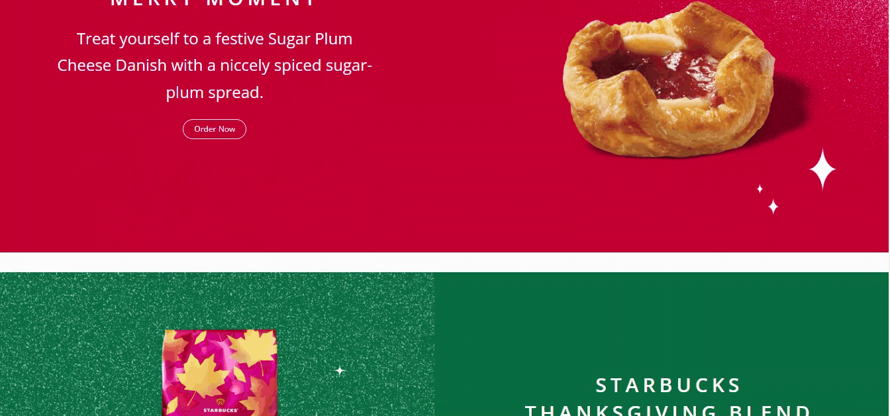

<h1> starbuckswebsite </h1>

This project represents a coffee shop website designed using HTML and CSS. The site offers visitors a minimalist and stylish interface introducing them to various beverages. The use of responsive design and different animations enhances usability.

<h2> The technologies used in the project </h2>

It was coded using HTML and CSS
technologies.

<h2> Screenshot </h2>

# starbucks
